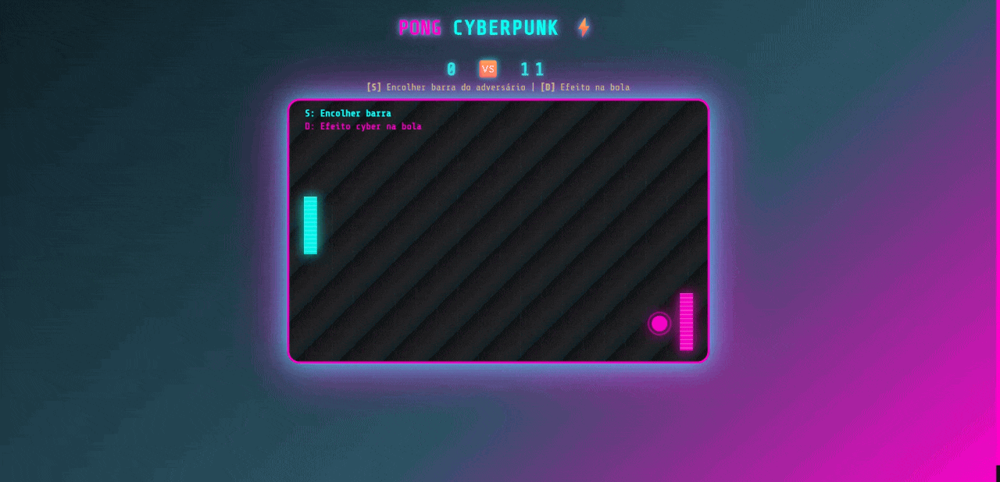

# 🕹️ Pong

Bem-vindo ao repositório do **Pong**, o clássico jogo porém em uma versão cyber!




---

## 🎮 Sobre o projeto

Este é um clone simples do clássico jogo **Pong**, desenvolvido com **HTML5, CSS3 e JavaScript puro**, com o objetivo de estudo e prática de programação.
Aqui você encontra uma versão simples e funcional que pode ser jogada diretamente no navegador.

---

## 🚀 Como rodar

1. **Clone o repositório:**
   ```bash
   git clone https://github.com/adstitan/pong.git
   ```
2. **Abra o arquivo `index.html`** em seu navegador.

Pronto! Divirta-se jogando Pong no seu próprio computador.

---

## 🛠️ Tecnologias utilizadas

- JavaScript
- HTML5
- CSS3

---

## 💡 Aprendizados

- Lógica de movimentação de objetos
- Detecção de colisão
- Manipulação de eventos no navegador
- Animações simples com JavaScript

---

## ✨ Contribuições

Sinta-se à vontade para abrir issues, sugerir melhorias ou enviar pull requests!

---

## 📄 Licença

Este projeto ainda não possui uma licença definida.

---

## 👤 Autor

[adstitan](https://github.com/adstitan)

---

<div align="center">
  
</div>